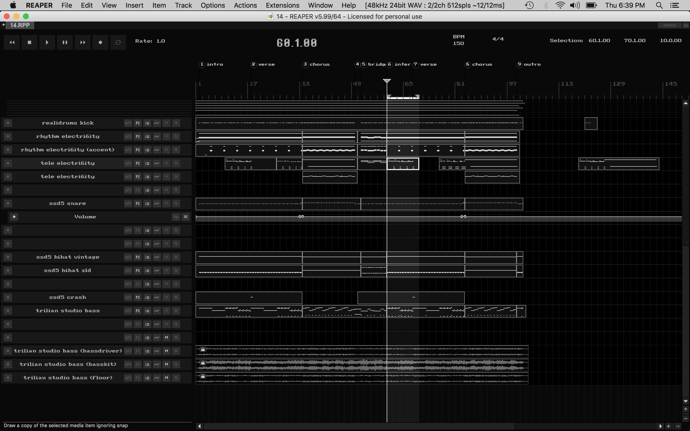
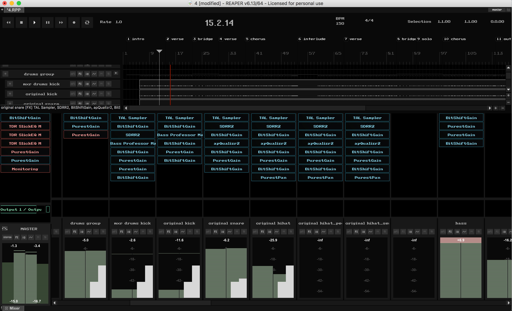
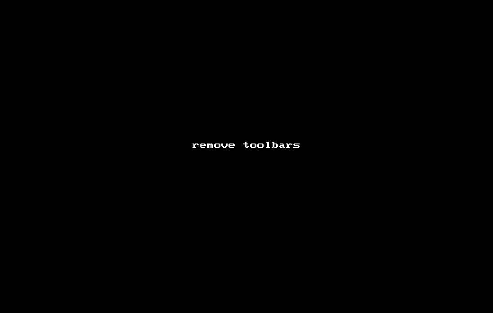

### [download](https://github.com/benjohnson2001/DarkTerminal/raw/master/DarkTerminal.ReaperThemeZip)

#### fonts:

WALTER fonts 1-8 are not used, every font specified in the theme uses the "Volume/pan label" font.

Volume/pan label font: ClassicVGA, 20         [download](https://github.com/benjohnson2001/DarkTerminal/raw/master/ClassicVGA.ttf)

Timeline font: Press Start 2P, 9         [download](https://github.com/benjohnson2001/DarkTerminal/raw/master/press-start-2p.regular.ttf)

Transport status font: Pixel Operator, Bold, 36         [download](https://github.com/benjohnson2001/DarkTerminal/raw/master/PixelOperator-Bold.ttf)

Media item label font: ClassicVGA, 9

